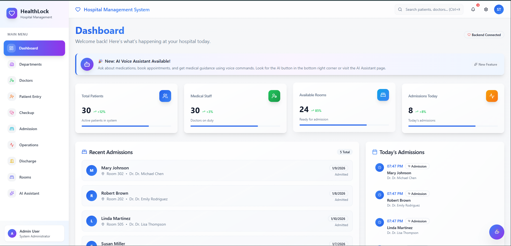

# 🏥 HealthLock – Hospital Management System

HealthLock is a modern, secure, and intelligent **Hospital Management System** designed to digitize and simplify hospital operations. It helps hospitals efficiently manage patients, doctors, staff, rooms, and medical records while improving patient care using smart automation and an AI Voice Assistant.

---

## 📌 Project Overview

HealthLock provides a **centralized digital platform** for hospitals to handle daily operations such as patient registration, admissions, checkups, room allocation, and discharge management.
The system reduces paperwork, saves time, minimizes human errors, and enhances overall hospital productivity.

---

## 🎯 Objectives

* Digitize hospital records and workflows
* Reduce manual paperwork and delays
* Improve doctor–patient coordination
* Provide real-time hospital statistics
* Enable smart assistance using AI Voice Assistant

---

## 🧩 Key Features

### 📊 Dashboard

* Total patients overview
* Medical staff availability
* Available rooms status
* Today’s admissions
* Recent admission records
* Real-time backend connectivity

### 🧑‍⚕️ Patient Management

* New patient registration
* Personal & medical information storage
* Department and doctor assignment
* Checkup scheduling
* Patient status tracking (Active / Discharged)

### 🏥 Hospital Operations

* Department management
* Doctor management
* Room availability tracking
* Admission & discharge workflow
* Operation and checkup records

### 🎙️ AI Voice Assistant

* Voice recognition & text-to-speech
* Medication information & side effects
* Appointment booking via voice commands
* Symptom checking & medical guidance
* Emergency service assistance
* Multilingual support (English & Hindi)

---

### 📊 Dashboard



### 📝 Patient Entry


### 🤖 AI Voice Assistant


---

## 🛠️ Technology Stack

### Frontend

* React.js
* typescript
* Tailwind CSS
* Modern UI Components

### Backend

* Node.js
* Express.js

### Database

* MongoDB

### AI & Voice

* Speech Recognition API
* Text-to-Speech API
* AI-powered medical responses

---

## 🔐 Security Features

* Secure authentication & authorization
* Role-based access (Admin, Doctor, Staff)
* Protected medical records
* Secure API communication

---

## ⚙️ Installation & Setup

```bash
# Clone the repository
git clone https://github.com/saurav688/healthlock.git

# Navigate to project folder
cd healthlock

# Install backend dependencies
cd server
npm install

# Install frontend dependencies
cd ../client
npm install

# Run backend
npm start

# Run frontend
npm run dev
```

---

## 📈 Future Enhancements

* Online payment & billing system
* Patient mobile application
* Electronic prescriptions (e-Prescriptions)
* Advanced analytics & reports
* Integration with wearable health devices

---

## 🌍 Social Impact

* Improves healthcare efficiency
* Reduces patient waiting time
* Ensures better data accuracy
* Supports digital healthcare transformation
* Helps rural and urban hospitals alike

---
## ⭐ Conclusion

HealthLock is a complete **next-generation hospital management solution** that combines digital healthcare management with intelligent AI assistance. It enhances hospital productivity, patient satisfaction, and overall healthcare quality.

* Add **UNSDGs mapping**
* Create **Project PPT**
* Write **Abstract, Problem Statement & Conclusion**

Just tell me 👍
